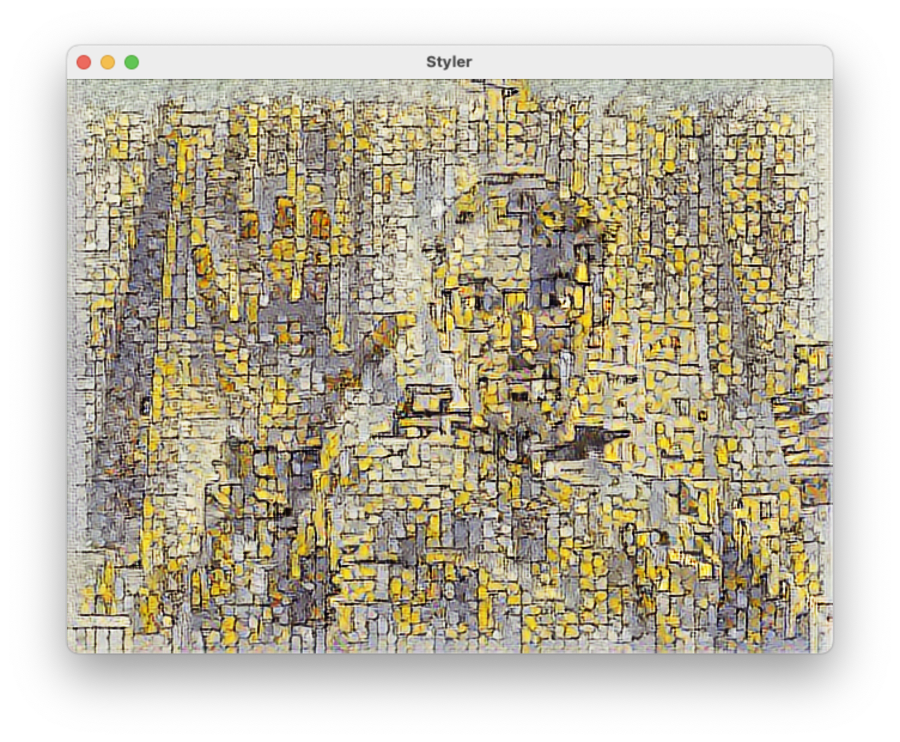

Styler
======



Arbitrary style transformation of an input image, video, or camera source.

This code base has been developed by [ZKM | Hertz-Lab](https://zkm.de/en/about-the-zkm/organization/hertz-lab) as part of the project [»The Intelligent Museum«](#the-intelligent-museum). 

Please raise issues, ask questions, throw in ideas or submit code, as this repository is intended to be an open platform to collaboratively improve language identification.

Copyright (c) 2022 ZKM | Karlsruhe.   
Copyright (c) 2022 Dan Wilcox.  

GPL v3 License.

Parts adapted from ofxTensorFlow2 example_style_transfer_arbitrary under a BSD Simplified License.

Dependencies
------------

* [openFrameworks](https://openframeworks.cc/download/)
* openFrameworks addons:
  - [ofxTensorFlow2](https://github.com/zkmkarlsruhe/ofxTensorFlow2)
* [CLI11 parser](https://github.com/CLIUtils/CLI11) (included in `src`)
* pre-trained Arbitrary Style Transfer model (download separately)

Structure
---------

* `src/`: contains the openFrameworks C++ code
* `bin/data/model`: contains the model trained with TensorFlow2
* `bin/data/style`: input style images
* `bin/data/image`: input images
* `bin/data/video`: input videos
* `bin/data/output`: saved output images

Installation & Build
--------------------

Overview:

1. Download the required TF2 model
2. Follow the steps in the ofxTensorFlow2 "Installation & Build" section for you platform
3. Generate the project files for this folder using the OF ProjectGenerator
4. Build for your platform

### Download Pre-Trained Model

A pre-trained style transfer model can be downloaded as a `model_style_transfer_arbitrary.zip` file from the public shared link here:

<https://cloud.zkm.de/index.php/s/gfWEjyEr9X4gyY6>

Unzip the file and place the `model` directory into the Styler `bin/data` directory.

To make this quick, a script is provided to download and install the model (requires a Unix shell, curl, and unzip):

```shell
./scripts/download_model.sh
```

### Generating Project Files

Project files are not included so you will need to generate the project files for your operating system and development environment using the OF ProjectGenerator which is included with the openFrameworks distribution.

To (re)generate project files for an existing project:

1. Click the "Import" button in the ProjectGenerator
2. Navigate to the project's parent folder ie. "apps/myApps", select the base folder for the example project ie. "Styler", and click the Open button
3. Click the "Update" button

If everything went Ok, you should now be able to open the generated project and build/run the example.

_Note: Some platforms require additional steps before / after project file generation. See following sections._

### macOS

On macOS, a couple of additional manual steps are required to use ofxTensorflow2:

1. Enable C++14 (minimum) or C++17 in openFrameworks (only once, Xcode + Makefile). See the detailed steps in the [ofxTensorflow2 readme](https://github.com/zkmkarlsruhe/ofxTensorFlow2#macos).
2. Generate Styler project files with the ProjectGenerator
3. Close the Styler project in Xcode if it's open, then run `configure_xcode.sh` to configure the Xcode project (after every project regeneration, Xcode only)\*:
```shell
scripts/configure_xcode.sh .
```

\*_Note: the `.` is important, it means "this directory."_

For an Xcode build, open the Xcode project, select the "Styler Debug" scheme, and hit "Run".

For a Makefile build, build and run on the terminal:

```shell
make ReleaseTF2
make RunRelease
```

### Linux

An additional step is required *before* generating the project files:

1. Run `configure_makefile.sh` to configure the project (only needed once)\*:
```shell
scripts/configure_makefile.sh .
```
2. Generate Styler project files with the ProjectGenerator

\*_Note: the `.` is important, it means "this directory."_

Next, build and run on the terminal:

```shell
make Release
make RunReleaseTF2
```

Usage
-----

Styler applies a given style image onto an input image. The input image can come from one of three input sources: static image(s), video frames, or camera frames.

Styler starts in fullscreen and uses the camera source by default.

### Input

Styler lists image and video paths automatically on start from the following directories:
* `bin/data/style`: style images, jpg or png (required)
* `bin/data/image`: input images, jpg or png, all paths added to playlist
* `bin/data/video`: input video files, mov or mp4 or avi, all paths added to playlist

Simply add/remove files from each and restart the application. Order is sorted by filename.

_Note: a minimum of 1 image must be in the style directory, otherwise Styler will exit on start due to missing input. If the input image or video directories are empty, the respective source will be disabled._

While running, any images drag & dropped onto the Styler window will be loaded as a new style.

### Key Commands

* `v`: video input
* `c`: camera input
* `i`: image input
* `m`: mirror camera
* `n`: flip camera
* `r`: restart video
* `f`: toggle fullscreen
* `s`: save output image to `bin/data/output` directory
* `k`: toggle style input mode
* `a`: toggle auto style change after last frame
* `LEFT`: previous style
* `RIGHT`: next style
* `SPACE`: toggle playback / take style image
* `UP`: next frame, when paused / (shift) next video
* `DOWN`: previous frame, when paused / (shift) prev video

### Automatic Style Change

When enabled, automatic style change will go to the next style based on the input source:
* camera: every 20 seconds
* image: when changing from the last image to the first image
* video: when changing from the last frame to the first frame

### Commandline Options

Additional run time settings are available via commandline options as shown via the `--help` flag output:

~~~
% bin/Styler --help
arbitrary style transformation of an input image, video, or camera source
Usage: Styler [OPTIONS]

Options:
  -h,--help                   Print this help message and exit
  -f,--fullscreen             start in fullscreen
  -a,--auto                   enable auto style change
  --auto-time FLOAT           set camera auto style change time in s, default 20
  -l,--list                   list camera devices and exit
  -d,--dev INT                camera device number, default 0
  -r,--rate INT               desired camera framerate, default 30
  -s,--size TEXT              desired camera size, default 640x480
  --mirror                    mirror camera horizontally
  --flip                      flip camera vertically
  --static-size               disable dynamic input -> output size handling
  -v,--verbose                verbose printing
  --version                   print version and exit

~~~

#### macOS

For macOS, the application binary can be invoked from within the .app bundle to pass commandline arguments:

~~~
bin/Styler.app/Contents/MacOS/Styler -h
~~~

or via the system `open` command using the `--args` flag:

~~~
open bin/Styler.app --args --device 1
~~~

_Note: `open` will launch the app without a Terminal window, so console output cannot be read._

This approach can also be wrapped up into a shell alias to be added to the account's `~/.bash_profile` or `~/.zshrc` file:

~~~
alias styler="/Applications/Styler.app/Contents/MacOS/Styler"
~~~

Close and reopen the shell. The application can now be invoked via:

~~~
styler -v --device 1
~~~

Another option is to use a wrapper script, such as the `styler.sh` script included with this repo:

~~~
./styler.sh -v --device 1
~~~

_Note: The `styler.sh` script uses the release build "Styler" .app naming. If you are testing with the debug build, edit the `APP` variable name to "StylerDebug"._

Develop
-------

### Release steps

1. Update changelog
2. Update app version in src/config.h define and openFrameworks-Info.plist
3. Tag version commit, ala "0.3.0"
4. Push commit and tags to server:
```shell
git commit push
git commit push --tags
```

### macOS build distribution

1. Set Signing & Capabilities Team
2. Enable Hardened Runtime
3. Notarize app
4. Bundle app and data into Styler-version distribution folder
5. Compress distribution folder into Styler-version.dmg disk image
6. Sign disk image

Once steps 1-2 are done, the remaining steps are automated via `Makefile-mac-dist.mk` using the `scripts/release_dmg.sh` wrapper script:
```shell
./scripts/release_dmg.sh
```

Known Issues
------------

### Xcode Legacy Build System error

If the build fails in Xcode 12 or 13 with a "The Legacy Build System will be removed in a future release." error, disable this warning via:
1. Open File->Project Settings
2. Check "Do not show a diagnostic issue about build system deprecation"
3. Click "Done"

_This is likely to be fixed via OF version 0.12._

### Xcode Release build errors due to missing _TF_ functions

When building for Debug, only the architecture of the system is built. When building for Release, multiple architectures will be targeted (Intel and Arm), however since libtensorflow builds are currently single arch only, the Release build will fail to link due to missing architectures.

The quick fix is to disable building for the non-system architecture, for example on an M1 system (arm64) we disable building for Intel (x86_64) and vice-versa in the Xcode project:

1. Click on the project in the top left of the project tree
2. Click on the project Target, then the Build Settings tab, make sure "All" is selected
3. Double-click on Excluded Architectures, and enter the non-system arch, ie. "x86_64" for an M1 "arm64" system, etc.

Now a Release rebuild should hopefully finish.

The Intelligent Museum
----------------------

An artistic-curatorial field of experimentation for deep learning and visitor participation

The [ZKM | Center for Art and Media](https://zkm.de/en) and the [Deutsches Museum Nuremberg](https://www.deutsches-museum.de/en/nuernberg/information/) cooperate with the goal of implementing an AI-supported exhibition. Together with researchers and international artists, new AI-based works of art will be realized during the next four years (2020-2023).  They will be embedded in the AI-supported exhibition in both houses. The Project „The Intelligent Museum” is funded by the Digital Culture Programme of the [Kulturstiftung des Bundes](https://www.kulturstiftung-des-bundes.de/en) (German Federal Cultural Foundation) and funded by the [Beauftragte der Bundesregierung für Kultur und Medien](https://www.bundesregierung.de/breg-de/bundesregierung/staatsministerin-fuer-kultur-und-medien) (Federal Government Commissioner for Culture and the Media).

As part of the project, digital curating will be critically examined using various approaches of digital art. Experimenting with new digital aesthetics and forms of expression enables new museum experiences and thus new ways of museum communication and visitor participation. The museum is transformed to a place of experience and critical exchange.


